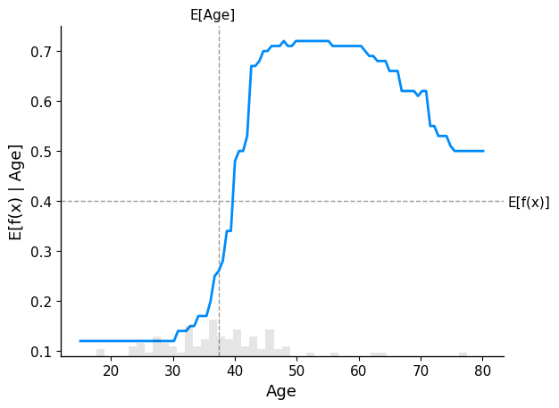
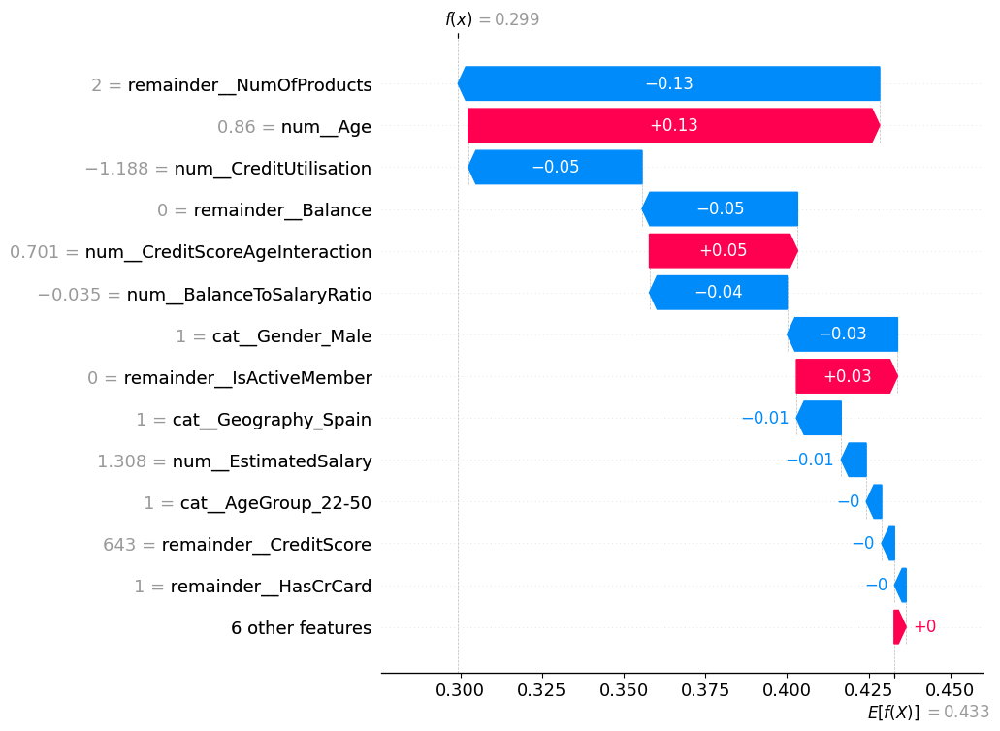

# Overview
I am trying to do EDA and to predict using ML to get insights from the data to build predictive models for understanding customer churn. Customer churn, also known as customer attrition, where customers stop doing business with a company or service. It is very important as this impacts the revenue and profitability. High churn rates can be due to customer dissatisfaction.

# Data Source
https://www.kaggle.com/datasets/rjmanoj/credit-card-customer-churn-prediction/data

This dataset is picked from Kaggle for credit card customer churn. *Exited* feature shows if a customer exited and cancelled their credit card or not. 
- 0- not cancelled
- 1 being cancelled  

The dataset consists of features like RowNumber,CustomerId,Surname,CreditScore,Geography,Gender,Age,Tenure,Balance,NumOfProducts,HasCrCard,IsActiveMember,EstimatedSalary,Exited

# Libraries Used
- pandas
- numpy
- matplotlib
- seaborn
- scikit-learn
- shap

# Key findings:

1. **Data imbalance**: The project implements different types of techniques to handle data imbalance
    - class weights: It uses class_weights ratio to specify the difference class imbalance and assign different weights for different classes.
    - SMOTE : Synthetically increase the minority class to match with other class
    - scale_pos_weight parameter: Balance positive and negative weights.
2. **Data inconsistence**: The data seems to have certain bias like customers younger has very low churn compared to middle aged customers. This may be because younger customers are starting to use banking and credit cards might not be readily available for them as they can be studying and has no history of credit score. 

# Methodology

CRISP-DM methodology is used for analysis. The business value is clearly understood and data is then cleaned, prepared for the models to train, validate and evaluate. The explainability part for the AI decisions are also provided using SHAP library.

# Results

| Model | Accuracy | Recall | Precision | f1_score | ROC AUC |
|:---|---:|---:|---:|---:|---:|
| lr_pl | 0.667500 | 0.763804 | 0.353693 | 0.483495 | 0.777179 |
| rf_pl | 0.752500 | 0.797546 | 0.440678 | 0.567686 | 0.850661 |
| xg_boost | 0.789375 | 0.720859 | 0.488565 | 0.582404 | 0.857343 |
| gradient_boosting | 0.847500 | 0.503067 | 0.666667 | 0.573427 | 0.847397 |

From the result after hypertuning on the churn prediction dataset, we can infer the following:

**Random Forest**- Performs well with highest Recall and F1-Score. This shows that this is the best performing model with high ROC AUC.
**XGBoost** - The second best model with second highest Recall and f1_score. The ROC AUC is the best for this model
**Logistic Regression** - This is the third best model with high Recall but lower Precision that has brought down the F1-score as well. This model has a moderate ROC AUC as well
**Gradient Boosting** - This is the least performance model with lowest Recall, F1-Score

# Explainability

1. Low Churn(Ages 20–35): Customers in this age bracket have the lowest predicted churn probability (around 0.12), well below the average. This is because of fewer customers with credit card at this age bracket.
2. Rapid Churn(Ages 35–45): The predicted churn probability increases steeply.
3. Peak Churn(Ages 45–60): This middle-aged segment shows the highest predicted churn probability (peaking around 0.70). The model identifies this group as the highest risk.

This graph can be used to understand how each prediction is made by the model. this helps to explain to business on how the decision is made

